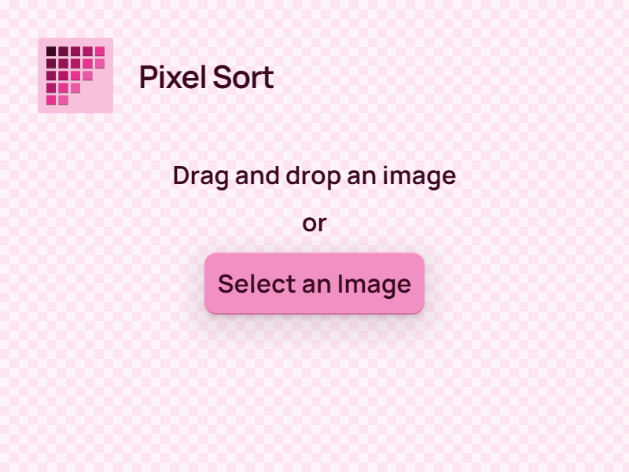
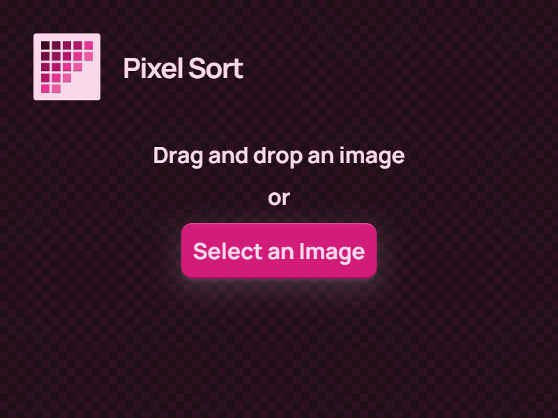
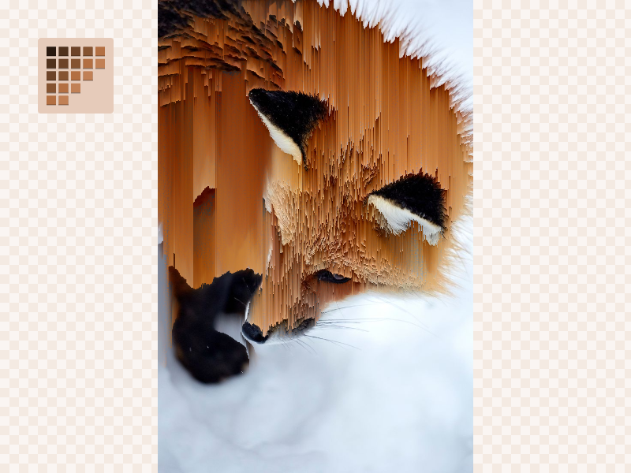
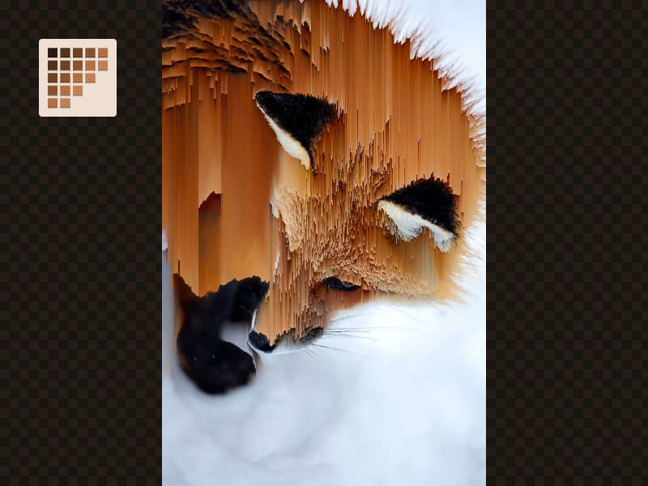

<div align="center">


# Pixel Sort

**Liven your photos with a glitch effect**

[](https://github.com/evelynhathaway/pixel-sort/actions)
[](/LICENSE)

</div>

## Description

Sort pixels in an image by certain the properties of each pixel to smear a nice glitch effect over your photos.

This pixel sorting project is an Next.js application with offscreen canvas support.

## Features

- Vertical and horizontal directions
- Sort by pixel properties
  - Hue
  - Saturation
  - Lightness
  - Red, Green, Blue, Alpha
  - RGB, RGBA Summation
- Offscreen canvas support

## Examples


## Screenshots

| Light Mode                                                                           | Dark Mode                                                                          |
| ------------------------------------------------------------------------------------ | ---------------------------------------------------------------------------------- |
|        |        |
|  |  |

## Usage

```bash
git clone git@github.com:evelynhathaway/pixel-sort.git
cd pixel-sort
npm clean-install
npm dev
```

## License

Copyright Evelyn Hathaway, [MIT License](/LICENSE)
